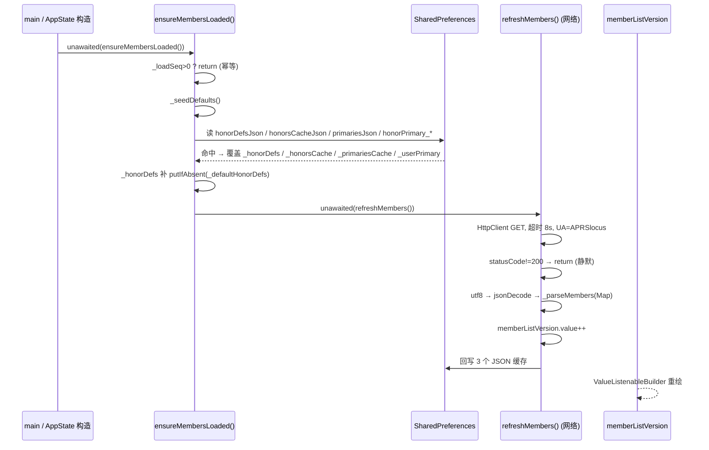

# 荣誉体系：解析与获取 Honors: Parsing & Retrieval

> **面向开发者**：荣誉数据「从哪来、怎么解析、怎么查、缓存在哪」的技术说明。
> 授予操作与新增称号的流程请看 [`HONORS.md`](HONORS.md)（那是维护指南，本文是代码级说明）。
> **面向用户的「怎么获得荣誉」**请看 [`HONORS-GUIDE.md`](HONORS-GUIDE.md)。
>
> 代码基线：**v1.6.91**｜主要实现：`lib/early_member.dart`（792 行）

---

## 1. 两层模型（先建立这个心智模型）

```
┌─ 称号定义 (honors) ──────────────────────────────┐
│  key → { 名称(三语), 描述(三语), 颜色, 图标名 }   │  ← 定义「有什么称号」
└─────────────────────────────────────────────────┘
                       ×  交叉
┌─ 成员授予 (developers / earlyMembers) ───────────┐
│  call → { honors: [key...], primary: key }       │  ← 定义「谁有哪个称号」
└─────────────────────────────────────────────────┘
```

**关键推论**：一个人「有哪些称号」= `成员.honors` ∩ `已定义称号`。
两者在同一个 `members.json` 里，但**分开解析**（`_parseMembers` 的两大段）。

> 由此产生一条重要规则：若某 key **没有定义**，即使它在某人的 `honors` 里，
> 也会被**静默丢弃**（[`memberHonorKeys`] 用 `displayHonorKeys.where(...)` 过滤，
> 而 `displayHonorKeys` 只包含已定义的 key）。这就是 `HONORS.md` 强调
> `_defaultHonorDefs` 不能漏的底层原因。

---

## 2. 数据源

三个**独立**的线上文件，都在 GitHub Pages（`aprslocus.theez.top`），
**推送后约 1 分钟生效，无需发版**：

| 文件 | 常量 | 用途 | 消费方 |
|---|---|---|---|
| `members.json` | `kMembersJsonUrl` | 称号定义 + 成员授予 | App、官网 |
| `firstfix.json` | `kFirstFixUrl`（在 `achievements.dart`） | FIRST FIX 授勋名单 | App、官网 |
| `sponsors.json` | `kSponsorsUrl`（在 `sponsor_page.dart`） | 赞助墙（**与称号无关**） | App、官网 |

```dart
// lib/early_member.dart:16
const String kMembersJsonUrl = 'https://aprslocus.theez.top/members.json';
// lib/early_member.dart:35
const String kMemberCardBase = 'https://aprslocus.theez.top/member-card.html';
```

> ⚠️ **FIRST FIX 是「半独立」的**：它**有**称号定义（在 `members.json` 的 `honors.firstFix`），
> 但**没有**成员授予 —— 名单在 `firstfix.json`，由 `memberHonorKeys()` **动态注入**（见 §5.1）。

---

## 3. 获取链路（Fetch）

### 3.1 App 侧时序



**要点**：

- **不阻塞启动**：`unawaited(...)`，且是在 `AppState` 构造函数里发起
  （`lib/state.dart:1200`）—— 荣誉数据晚到不影响地图/连接。
- **三重数据来源，优先级递增**：内置 seed → 本地缓存 → 在线。
- **幂等**：`_loadSeq > 0` 直接返回，重复调用不会重复拉取。
- **全程静默失败**：`statusCode != 200`、超时、JSON 非法、字段缺失，
  一律 `return` / `catch (_) {}`，**绝不让荣誉数据影响主流程**。

### 3.2 网络细节

```dart
// lib/early_member.dart:412 refreshMembers()
final client = HttpClient()..connectionTimeout = const Duration(seconds: 8);
final req = await client.getUrl(Uri.parse(kMembersJsonUrl))
    .timeout(const Duration(seconds: 8));
req.headers.set(HttpHeaders.userAgentHeader, 'APRSlocus');
final resp = await req.close().timeout(const Duration(seconds: 8));
if (resp.statusCode != 200) return;          // 非 200 直接放弃（不抛错）
final body = await resp.transform(utf8.decoder).join();
final d = jsonDecode(body);
if (d is! Map) return;                        // 顶层必须是对象
_parseMembers(d);
```

### 3.3 官网侧

官网是**独立的 JS 实现**（不是 Dart），各自解析：

```js
// docs/member-card.html:480
fetch("members.json").then(r => r.ok ? r.json() : null).then(d => applyRemote(d)).catch(() => {});
fetch("firstfix.json").then(...)   // :482

// docs/badge.html:123
fetch("members.json").then(r => r.ok ? r.json() : null)
  .then(d => { window.__members = d; render(); }).catch(() => {});
```

> 所以**新增称号需要两端各登记一次**（Dart 侧 3 处 + 网页侧 3 处，共 7 处）——
> 这正是 `HONORS.md` 反复强调「最容易漏」的原因。

---

## 4. 解析（Parse）

### 4.1 身份归一化

```dart
// lib/early_member.dart:243
String _base(String call) => call.trim().toUpperCase().split('-').first;
```

**所有查询入口都先过 `_base()`**：去 SSID（`BG7PGW-2` → `BG7PGW`）+ 大写。

> ⚠️ **一个不对称之处（易踩）**：`_parseMembers` 里给成员建索引时用的是
> `call.toString().toUpperCase()` —— **只大写、不去 SSID**。
> 而查询走 `_base()`（去 SSID）。两者只有在 `members.json` 里写**不带 SSID 的基呼号**
> 时才一致。**所以 `members.json` 的 `call` 必须是基呼号**（现有数据均满足）。
> 若哪天写成 `BG7PGW-2`，该成员的所有称号都会查不到。

### 4.2 称号定义解析

```dart
// lib/early_member.dart:342 _parseMembers()
final hDefs = d['honors'];
if (hDefs is Map && hDefs.isNotEmpty) {          // 空表不清空旧定义（防空数据击穿）
  final m = <String, Honor>{};
  hDefs.forEach((k, v) {
    String pick(Map src, String lang, String fb) => (src[lang] ?? fb).toString();
    final zh = pick(v, 'zh', k.toString());       // 名称基准取 zh
    final dmap = v['desc'] is Map ? v['desc'] : const {};
    final descZh = pick(dmap, 'zh', '');          // 描述基准取 desc.zh
    m[k] = Honor(k, zh, descZh,
        _parseColor(v['color']),                  // "#RRGGBB" → Color
        Honor.iconForName(v['icon'], k),          // icon 名 → IconData
        labels: {'zh': zh, 'zh-TW': pick(v,'zh-TW',zh), 'en': pick(v,'en',zh)},
        descs:  {'zh': descZh, 'zh-TW': ..., 'en': ...});
  });
  // 在线优先 + 本地兜底补齐（注意是 putIfAbsent：在线定义不被覆盖）
  for (final e in _defaultHonorDefs.entries) m.putIfAbsent(e.key, () => e.value);
  _honorDefs = m;
}
```

细节：

- **`pick` 的回落链**：`该语言 → fb`。`fb` 对名称是 `zh`（而非空串），
  所以**缺 `zh` 时会退化成 key 本身**（`k.toString()`）。
- **`_parseColor`**：只认 6 位 `#RRGGBB`；解析失败 → `Color(0xFF7A879D)`（灰）。
- **`icon` 命名空间共用**：`members.json` 的 `icon` 与 Dart 的 `Honor.iconMap`
  是同一套 key；未命中 → 按称号 key 再映射一次 → 仍未命中 → 通用奖杯
  `Icons.emoji_events_rounded`。
- **`putIfAbsent` 的方向**：**在线定义优先**，本地 `_defaultHonorDefs` 只补缺。
  所以线上改了颜色/文案会立即覆盖本地兜底。
- **`criteria` 不被 App 解析**：`members.json` 的 `honors[].criteria`（三语「获得条件」，
  v44 起）是**官网专用**展示字段 —— `_parseMembers` 只取 `zh` / `desc` / `color` / `icon`，
  **Dart 侧完全不读**。所以增改 `criteria` 只影响官网（`badge.html` 显示、
  `member-card.html` 胶囊 `title`），**不改变 App 行为**。

### 4.3 成员授予解析

```dart
// lib/early_member.dart:381
void addMember(dynamic it, String defHonor) {
  String? call; List? honors; Object? primary;
  if (it is String)      { call = it; }                  // 纯字符串写法
  else if (it is Map)    { call = it['call']; honors = it['honors']; primary = it['primary']; }
  if (call == null || call.toString().isEmpty) return;
  final key = call.toString().toUpperCase();
  // honors 为空/缺失 → 用该分区的默认称号
  cache[key] = (honors != null && honors.isNotEmpty)
      ? honors.map((x) => x.toString()).toList()
      : [defHonor];
  if (primary != null) prim[key] = primary.toString();
}

for (final m in d['developers']   ?? const []) addMember(m, 'kaishan');      // 默认「开山」
for (final m in d['earlyMembers'] ?? const []) addMember(m, 'earlyMember');  // 默认「早期成员」
if (cache.isNotEmpty) _honorsCache = cache;             // 空表不清空（防空数据击穿）
if (prim.isNotEmpty)  _primariesCache = prim;
```

**两种写法都支持**（这是为兼容早期数据）：

```jsonc
"earlyMembers": [
  "BG7ABC",                                     // ① 纯字符串 → 自动获得 earlyMember
  { "call": "BG7PGW", "honors": ["kaishan","earlyMember"], "primary": "kaishan" }  // ② 对象
]
```

**分区的默认称号**：`developers` → `kaishan`，`earlyMembers` → `earlyMember`。
所以一个只写 `"BG7ABC"` 的开发者，会自动拿到「开山」。

---

## 5. 获取（查询 API）

全部是**同步、纯内存**查询（数据已在 `_honorsCache` / `_honorDefs` 里）。

### 5.1 拥有的称号

```dart
// lib/early_member.dart:271
List<String> memberHonorKeys(String call) {
  final base = _base(call);
  final got  = _honorsCache[base] ?? const <String>[];
  final set  = got.toSet();
  // FIRST FIX：名单在 firstfix.json，动态注入，不需要写进 members.json
  if (AchievementCenter.instance.isFirstFixHolder(base)) set.add('firstFix');
  return displayHonorKeys.where(set.contains).toList();   // ← 排序 + 过滤未定义 key
}
```

> **`displayHonorKeys.where(...)` 一举两得**：
> ① 输出顺序按 `displayHonorKeys` 排序；
> ② 自动丢弃「没定义的 key」（见 §1 的推论）。

### 5.2 派生 API

| 函数 | 返回 | 说明 |
|---|---|---|
| `memberHonorKeys(call)` | `List<String>` | 拥有的称号 key（已排序、已过滤） |
| `hasAnyHonor(call)` | `bool` | 是否有任意称号 |
| `honorsOf(call)` | `List<Honor>` | 拥有的称号**对象**（`whereType<Honor>()` 跳过未定义） |
| `ownedHonorsOf(call)` | `List<Honor>` | `honorsOf` 的别名（供选择器用） |
| `allHonorsWithState(call)` | `List<({Honor honor, bool owned})>` | **全量**称号 + 是否拥有（荣誉墙用） |
| `primaryHonorOf(call)` | `Honor?` | 主展示徽章（见 §6） |
| `userPrimaryKeyOf(call)` | `String?` | 用户自选的主徽章（无效则 null） |

### 5.3 排序

```dart
// lib/early_member.dart:99
List<String> get displayHonorKeys {
  final keys = <String>[];
  for (final k in _honorDefs.keys) if (!keys.contains(k)) keys.add(k);  // ① 在线键序
  for (final k in kHonorOrder)     if (!keys.contains(k)) keys.add(k);  // ② 本地兜底补齐
  return keys;
}
```

`_honorDefs.keys` 的顺序 = `members.json` 里 `honors` 的**书写顺序**
（Dart 的 `Map` 保持插入序，`jsonDecode` 亦保持）。
所以**调整 `members.json` 里 `honors` 各 key 的先后，就能调整 App 内展示顺序**。

---

## 6. 主徽章（primary）的三级优先

```dart
// lib/early_member.dart:315  primaryHonorOf()
Honor? primaryHonorOf(String call) {
  final keys = memberHonorKeys(call);
  if (keys.isEmpty) return null;
  final base = _base(call);
  // ① 用户在本机手动选的（仅当仍拥有时才认）
  final user = _userPrimary[base];
  if (user != null && keys.contains(user) && _honorDefs[user] != null) return _honorDefs[user];
  // ② members.json 的 primary（仅当仍然拥有时才认）
  final p = _primariesCache[base];
  if (p != null && _honorDefs[p] != null && keys.contains(p)) return _honorDefs[p];
  // ③ 兜底：排序后的第一个
  return _honorDefs[keys.first];
}
```

| 优先级 | 来源 | 失效条件 |
|---|---|---|
| ① | `_userPrimary[base]`（用户本机选择） | 该称号已被撤销 / 未定义 |
| ② | `members.json` 的 `primary` | 同上 |
| ③ | `keys.first`（排序后第一个） | — |

**用户自选**的持久化：

```dart
// lib/early_member.dart:303  setUserPrimary()
Future<void> setUserPrimary(String call, String honorKey) async {
  final base = _base(call);
  if (!memberHonorKeys(call).contains(honorKey)) return;   // 只能选已拥有的
  _userPrimary[base] = honorKey;
  memberListVersion.value++;
  final p = await SharedPreferences.getInstance();
  await p.setString('honorPrimary_$base', honorKey);        // ← 每呼号一个 key
}
```

> 注意：`_userPrimary` 是**本机**偏好，**不上传**、不影响他人（与 `members.json` 的
> `primary` 是两回事）。

---

## 7. 持久化 / 缓存

| SharedPreferences key | 内容 | 写入方 | 读取方 |
|---|---|---|---|
| `honorDefsJson` | 称号定义（**三语一并存**） | `refreshMembers` | `ensureMembersLoaded` |
| `honorsCacheJson` | `呼号 → [honorKey]` | 同上 | 同上 |
| `primariesJson` | `呼号 → primary` | 同上 | 同上 |
| `honorPrimary_<BASE>` | 用户自选主徽章（一人一键） | `setUserPrimary` | `ensureMembersLoaded` 扫描前缀 |
| `firstFixHolders` | FIRST FIX 名单 JSON 数组 | `achievements.dart` | 同左 |

**为什么定义要存三语**（`_serializeDefs()`）：

```dart
Map<String, dynamic> _serializeDefs() => _honorDefs.map((k, h) => MapEntry(k, {
  'label': h.label, 'labelZhTw': h.labelOf('zh-TW'), 'labelEn': h.labelOf('en'),
  'desc':  h.desc,  'descZhTw':  h.descOf('zh-TW'),  'descEn':  h.descOf('en'),
  'color': '#${h.color.value.toRadixString(16).padLeft(8,'0').substring(2)}',
  'icon':  h.iconName ?? k,
}));
```

→ **离线时切换界面语言，荣誉文案仍能正确显示**（否则离线只剩中文基准）。

**冷启动时的数据来源优先级**（`ensureMembersLoaded`）：

```
内置 seed(_seedDefaults, 9 人)
      ↓ 被本地缓存覆盖
本地缓存(honorDefsJson / honorsCacheJson / primariesJson)
      ↓ 被在线数据覆盖（异步）
在线 members.json
```

`_seedDefaults()` 是**第 3 层兜底**（硬编码 **9 人**：4 位 `developers` + 5 位早期成员），
保证**全新安装且无网络**时核心成员的徽章仍能正确显示 ——
避免「第一次打开还没联网就一无所有」。
（注：它只是**应急快照**，真实名单以 `members.json` 为准。）

---

## 8. 语言回落

```dart
// lib/early_member.dart:23
String honorLangOf(BuildContext context) {
  final l = Localizations.maybeLocaleOf(context);
  if (l == null) return 'zh';
  if (l.languageCode == 'zh') {
    final tw = l.countryCode == 'TW' || l.scriptCode == 'Hant'
            || l.toString().toLowerCase().contains('tw');
    return tw ? 'zh-TW' : 'zh';
  }
  return 'en';       // ← 日语、印尼语等**全部**走英文
}
```

| 界面语言 | 荣誉文案语言 |
|---|---|
| 中文（简体） | `zh` |
| 中文（繁體） | `zh-TW` |
| 英文 | `en` |
| **日本語 / Bahasa Indonesia / 其它** | **`en`** |

`Honor` 的取值回落链：

```dart
String labelOf(String lang) => labels?[lang] ?? labels?['en'] ?? label;  // 该语言 → 英文 → 中文基准
String descOf(String lang)  => descs?[lang]  ?? descs?['en']  ?? desc;   // 同上
```

> **历史坑（v1.6.87 修复）**：`honorLangOf` 曾对 ja/id 返回 `'ja'`/`'id'`，
> 而 `members.json` / `sponsors.json` **只维护 zh / zh-TW / en 三套**
> → 逐级回落最终落到**中文基准** → 日语用户看到中文。
> 现改为只认 `en`。**新增语言时无需改这里**（自动走英文）。

---

## 9. 消费点（谁在用）

| 位置 | 用到的 API | 展示 |
|---|---|---|
| `lib/settings_page.dart:62` | `HonorBadge(myCall, ...)` | 设置页顶部徽章 |
| `lib/settings_pages.dart:110–160` | `HonorBadge` / `primaryHonorOf` / `memberListVersion` | 个人资料 + 主徽章选择器 |
| `lib/station_detail.dart:1139–1141` | `honorsOf(call)` / `memberListVersion` | 台站详情「荣誉」行 |
| `lib/honor_wall_page.dart:61–63` | `allHonorsWithState(call)` / `memberListVersion` | 荣誉墙（全量 + 已获标记） |
| `lib/early_member.dart:521` | `openMemberCard(call)` | 打开官网会员卡 |

**UI 刷新机制**：`memberListVersion`（`ValueNotifier<int>`）在
① `refreshMembers` 成功后、② `setUserPrimary` 时 `value++`，
各页面用 `ValueListenableBuilder` 监听 → 无需重建整棵树。

---

## 10. FIRST FIX 的特殊路径

FIRST FIX（`firstFix`，至高荣誉）是**唯一**不走「成员 `honors` 数组」的称号：

```
firstfix.json  →  achievements.dart  →  _firstFixHolders  →  isFirstFixHolder(base)
                                              ↓
                            memberHonorKeys() 动态 set.add('firstFix')
```

- 名单文件：`docs/firstfix.json` → `{ version, updated, note, holders: ["BG7LZQ"] }`
- 拉取常量：`achievements.dart:44 kFirstFixUrl`
- 本地缓存：SharedPreferences `firstFixHolders`
- **意义**：授勋**不必改 `members.json`**，也不必动任何人的 `honors` 数组；
  同时它仍是**正常称号**（有定义、有颜色、可作 primary、上荣誉墙）。

---

## 11. 扩展指引

### 给某人追加**已有**称号

只改 `docs/members.json`（1 个文件，**无需发版**）→ 见 [`HONORS.md` §①](HONORS.md)。

### **新增**一个称号

需登记 **7 处**（Dart 3 + 网页 3 + 数据 1），漏一处就局部失灵 → 见 [`HONORS.md` §②](HONORS.md)。

### 上赞助墙

**与称号完全独立**（`sponsors.json` + 官网 HTML 写死），见 [`HONORS.md` §③](HONORS.md)。

---

## 12. 已知问题 / 易错点

### ⚠️ 设计陷阱

1. **`_defaultHonorDefs` 是「空判断」不是「默认值」**
   取用处写成 `_honorDefs[k] != null` / `.whereType<Honor>()`，
   所以**漏登记 = 该称号整条不显示**（离线则永久），而不只是少个图标。

2. **成员索引只大写、不去 SSID**（§4.1）
   `members.json` 的 `call` **必须是基呼号**，否则查不到。

3. **未定义的 key 会被静默丢弃**（§1）
   往某人 `honors` 里写了一个新 key、却没在 `honors` 里定义它 → 毫无反应且无报错。

4. **`honors` 的书写顺序 = App 展示顺序**（§5.3），不是按授勋时间。

5. **`members.json` 不能写注释**（`//` 会让 `jsonDecode` 直接失败，
   而失败被 `catch(_){}` 吞掉 → 表现为「线上一直不更新」，很难查）。

6. **`version` / `updated` 不参与任何逻辑**，纯人工追溯。

7. **官网与 App 是两套独立实现**，改一处不会同步另一处。

### 🐞 现存代码异味（静态分析发现，未修）

| 位置 | 问题 | 影响 |
|---|---|---|
| `early_member.dart:244` | `_norm()` **定义但从未调用**（`unused_element`） | 死代码 |
| `early_member.dart:586` | `_HonorWallSheet` **未被引用**（`unused_element`） | 死代码，疑被 `honor_wall_page.dart` 取代 |
| `early_member.dart:446` | `h.color.value` 用了**已弃用**的 `.value` | 未来 Flutter 版本会移除；建议改 `.toARGB32()` |
| `early_member.dart:467` | `只可能非 null 的值 == null`（`unnecessary_null_comparison`） | 冗余判断 |

> 以上 4 条都在 `flutter analyze` 的既有 99 条告警里，**不是新增问题**。
> 清理它们是低风险的小改动，但涉及行为判断（尤其 `_HonorWallSheet` 是否真的可删），
> 建议单独一个提交、单独验证。

### ✅ 改动后的自检清单

```bash
# 1) JSON 合法性（最容易犯且最难查）
python3 -c "import json;json.load(open('docs/members.json',encoding='utf-8'));print('ok')"

# 2) 定义完整性：成员引用的每个 key 都必须有定义
python3 - <<'PY'
import json; d=json.load(open('docs/members.json',encoding='utf-8'))
defs=set(d['honors']); bad=set()
for m in d['developers']+d['earlyMembers']:
    if isinstance(m,dict):
        bad |= set(m.get('honors') or []) - defs
        if m.get('primary') and m['primary'] not in defs: bad.add('primary:'+m['primary'])
print('未定义的引用:', bad or 'NONE')
PY

# 3) honors 为空/成员 honors 为空 → 走默认称号，确认是否符合预期

# 4) Dart 侧编译（CI 会做）
flutter analyze
```

---

## 13. 速查表

```
线上文件   members.json / firstfix.json / sponsors.json   (Pages, ~1min 生效)
入口       state.dart:1200  ensureMembersLoaded()  (AppState 构造, unawaited)
拉取       early_member.dart:412  refreshMembers()  (8s 超时, 静默失败)
解析       early_member.dart:342  _parseMembers()   (定义 + 授予 两段)
归一化     early_member.dart:243  _base()           (去 SSID + 大写)
查询       memberHonorKeys / honorsOf / allHonorsWithState / primaryHonorOf
主徽章     用户选择 > members.json primary > 排序第一个
排序       displayHonorKeys  (在线 honors 键序 优先)
缓存       honorDefsJson / honorsCacheJson / primariesJson / honorPrimary_<BASE>
语言       honorLangOf(): zh / zh-TW / en(其余全部，含 ja/id)
刷新       memberListVersion (ValueNotifier<int>) → ValueListenableBuilder
FIRST FIX  firstfix.json → isFirstFixHolder() → 动态注入 'firstFix'
```

---

## 📎 相关

| 文件 | 说明 |
|---|---|
| [`HONORS.md`](HONORS.md) | **维护指南**：授予称号 / 新增称号的 7 处登记点 / 校验清单 |
| [`HONORS-GUIDE.md`](HONORS-GUIDE.md) | **面向用户**：成就条件 / 徽章含义 / 申请渠道 |
| `docs/members.json` | 称号定义 + 成员授予（唯一真源） |
| `docs/firstfix.json` | FIRST FIX 授勋名单 |
| `docs/sponsors.json` | 赞助名单（独立于称号） |
| `lib/early_member.dart` | **本文主角**：定义、兜底、拉取、解析、查询 |
| `lib/achievements.dart` | 成就中心 + FIRST FIX 名单拉取 |
| `lib/honor_wall_page.dart` | 荣誉墙页面 |
| `lib/sponsor_page.dart` | 赞助页 |
| `docs/member-card.html` / `docs/badge.html` | 官网会员卡 / 徽章页（独立 JS 实现） |
